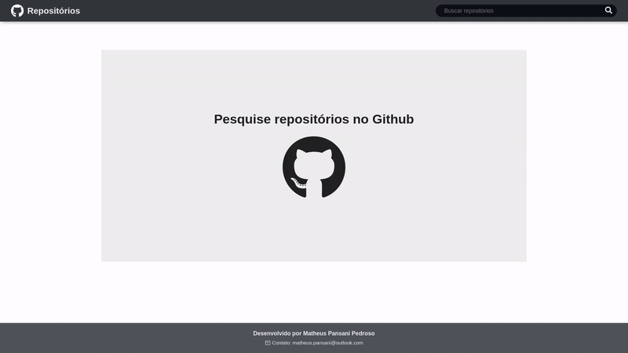
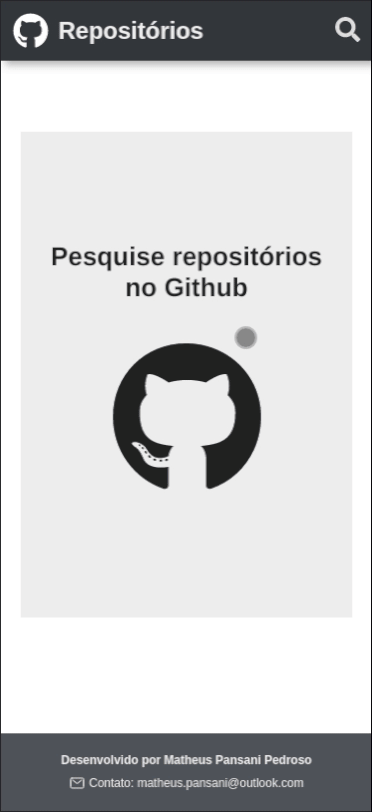

# Buscador de repositórios

> O projeto é uma aplicação web de busca a repositórios no Github, desenvolvida em React com Typescript. A aplicação permite ordenar os resultados da busca por melhor match, mais ou menos estrelas, mais ou menos forks, e por atualização mais ou menos recente.É possível filtrar os resultados incluindo ou exibindo somente repositórios fork.

### Ajustes e melhorias

O projeto encontra-se em desenvolvimento seguindo o seguinte fluxo:

- [x] Criação da página
- [x] Integração com a API do Github
- [x] Migração para Typescript
- [x] Componentização
- [x] Aperfeiçoamento do layout responsivo
- [ ] Testes

## ☕ Usando o Buscador de repositórios

Exemplo de utilização da aplicação desktop:

  

Exemplo de utilização mobile:

  

Para cada repositório listado é exibido o nome do proprietário / nome do repositório, a descrição, número de estrelas, forks e issues abertas (todos com os respectivos links no Github).

A aplicação também exibe o tamanho do repositório (KB ou MB), a linguagem mais usada no projeto, o tipo de licença, a data de criação e a data da última atualização.
